# PRD — Nusantara TwinChain

**Versi:** 2.0  
**Tanggal:** 3 April 2026  
**Status:** Draft  

---

## Daftar Isi

1. [Overview](#1-overview)
2. [Requirements](#2-requirements)
3. [Core Features](#3-core-features)
4. [User Flow](#4-user-flow)
5. [Architecture](#5-architecture)
6. [Sequence Diagram](#6-sequence-diagram)
7. [Database Schema](#7-database-schema)
8. [Tech Stack](#8-tech-stack)

---

## 1. Overview

### 1.1 Ringkasan Produk

Nusantara TwinChain adalah platform nasional berbasis web yang mengintegrasikan teknologi **AI** dan **Blockchain** untuk melakukan tracking, pencatatan, analisis, dan transaksi komoditas pertanian di seluruh Indonesia. Platform ini menjadi satu wadah bagi pemerintah pusat, dinas pertanian daerah, Bulog, petani, distributor, hingga konsumen untuk secara kolektif membangun ekosistem data pangan yang transparan, akuntabel, dan actionable.

Platform ini bukan sekadar dashboard visualisasi — melainkan sebuah **decision support system** yang mampu memberikan insight berbasis AI, memprediksi tren harga dan hasil panen, mendeteksi anomali seperti penimbunan, serta menyediakan marketplace terdesentralisasi dengan pencatatan transaksi on-chain untuk menjamin transparansi rantai pasok dari hulu ke hilir.

### 1.2 Problem Statement

Indonesia menghadapi beberapa masalah struktural dalam ketahanan pangan:

- **Data terfragmentasi** — Data lahan, panen, distribusi, dan harga tersebar di berbagai instansi tanpa integrasi. Pengambilan keputusan lambat karena data tidak real-time.
- **Disparitas harga** — Harga komoditas bisa berbeda drastis antar daerah karena panjangnya rantai distribusi dan kurangnya transparansi.
- **Penimbunan & spekulasi** — Tidak ada mekanisme deteksi dini terhadap praktik penimbunan yang memicu kelangkaan artifisial.
- **Petani sebagai pihak terlemah** — Petani sering menjual dengan harga rendah karena tidak punya akses pasar langsung dan tidak punya data posisi tawar.
- **Evaluasi ketahanan pangan sulit** — Pemerintah pusat kesulitan mengevaluasi secara real-time apakah Indonesia surplus, defisit, perlu impor, atau bisa ekspor.

### 1.3 Target User

| Prioritas | User | Peran |
|-----------|------|-------|
| 1 | **Pemerintah Pusat** (Kementan, Bapanas) | Monitoring nasional, evaluasi ketahanan pangan, penetapan kebijakan |
| 2 | **Dinas Pertanian Daerah** | Input data regional, sosialisasi ke petani, monitoring harga daerah |
| 3 | **Bulog** | Pencatatan stok gudang, distribusi, manajemen cadangan pangan |
| 4 | **Petani** | Pencatatan lahan & panen, penjualan via marketplace |
| 5 | **Distributor/Pedagang** | Pembelian komoditas, distribusi, pencatatan transaksi |
| 6 | **Konsumen/Masyarakat** | Monitoring harga, pembelian langsung dari petani/distributor |

### 1.4 Value Proposition

- **Bagi Pemerintah:** Satu sumber data nasional yang real-time untuk evaluasi ketahanan pangan dan dasar pengambilan kebijakan berbasis AI.
- **Bagi Petani:** Akses pasar langsung tanpa perantara berlebih, data harga transparan, dan pencatatan hasil panen yang terstruktur.
- **Bagi Bulog:** Sistem pencatatan stok dan distribusi terintegrasi dengan data nasional.
- **Bagi Masyarakat:** Transparansi harga pangan dan akses pembelian langsung dari produsen.
- **Bagi Ekosistem:** Blockchain menjamin setiap transaksi tercatat, tidak bisa dimanipulasi, dan bisa diaudit kapan saja.

---

## 2. Requirements

### 2.1 Functional Requirements

| ID | Requirement | Deskripsi |
|----|------------|-----------|
| FR-01 | Manajemen User & Role | Sistem multi-role dengan hak akses berbeda per level (superadmin, pemerintah pusat, dinas daerah, bulog, petani, distributor, konsumen) |
| FR-02 | Pencatatan Data Pertanian | Input data lahan, perkiraan panen, hasil panen aktual, jenis komoditas per wilayah |
| FR-03 | Pencatatan Stok & Distribusi Bulog | Input dan monitoring stok gudang Bulog, distribusi masuk/keluar per region |
| FR-04 | Dashboard Visualisasi | Peta interaktif (geospatial/choropleth), grafik, chart, dan tabel data dengan filter & ekspor |
| FR-05 | Monitoring Harga | Tracking harga komoditas per daerah, rata-rata nasional, tren historis |
| FR-06 | Marketplace On-Chain | Platform transaksi komoditas dengan pencatatan otomatis di blockchain |
| FR-07 | AI Analytics & Prediksi | Analisis data, prediksi harga & panen, rekomendasi kebijakan |
| FR-08 | AI Chatbot | Chatbot untuk tanya jawab data, insight, dan navigasi platform |
| FR-09 | Deteksi Anomali | Identifikasi pola penimbunan, lonjakan harga tidak wajar, ketidaksesuaian data |
| FR-10 | Sistem Notifikasi | Alert melalui email, push notification, WhatsApp, dan SMS |
| FR-11 | Integrasi Data Eksternal | Koneksi API ke BPS, Kementan, dan perangkat IoT di lapangan |
| FR-12 | Evaluasi Ketahanan Pangan | Scorecard nasional — surplus/defisit per komoditas, rekomendasi impor/ekspor |
| FR-13 | Laporan & Ekspor | Generate laporan periodik (PDF/Excel) untuk kebutuhan instansi |
| FR-14 | Audit Trail | Semua aksi tercatat — siapa melakukan apa, kapan, terhadap data apa |

### 2.2 Non-Functional Requirements

| ID | Kategori | Requirement |
|----|----------|------------|
| NFR-01 | **Performa** | Dashboard load < 3 detik untuk dataset hingga 1 juta record |
| NFR-02 | **Skalabilitas** | Arsitektur microservice yang bisa scale horizontal seiring bertambahnya daerah & user |
| NFR-03 | **Keamanan** | Enkripsi data at-rest dan in-transit, OAuth 2.0 + JWT, role-based access control (RBAC) |
| NFR-04 | **Ketersediaan** | Uptime target 99.5% dengan failover mechanism |
| NFR-05 | **Blockchain** | Throughput minimal 100 TPS untuk pencatatan transaksi marketplace |
| NFR-06 | **Lokalisasi** | Dual language: Bahasa Indonesia (default) + English |
| NFR-07 | **Aksesibilitas** | Responsive web, WCAG 2.1 level AA |
| NFR-08 | **Data Integrity** | Backup harian, point-in-time recovery, data validation di setiap entry point |
| NFR-09 | **Compliance** | Sesuai regulasi Satu Data Indonesia, UU Perlindungan Data Pribadi |
| NFR-10 | **IoT Compatibility** | Support protokol MQTT dan HTTP untuk ingest data sensor |

---

## 3. Core Features

### P0 — Must Have (MVP)

#### 3.1 Manajemen User Multi-Role
**Prioritas:** P0  
Sistem autentikasi dan otorisasi dengan 7 level role. Setiap role memiliki dashboard, menu, dan akses data yang berbeda. Pemerintah pusat bisa melihat data nasional, dinas daerah hanya melihat data wilayahnya, petani hanya melihat data miliknya sendiri + marketplace.

**Behavior:**
- Registrasi dengan verifikasi identitas (NIK untuk individu, kode instansi untuk pemerintah)
- Login via email/password + OTP (2FA)
- Admin pusat bisa assign role dan wilayah cakupan
- Setiap role punya sidebar menu dan dashboard yang berbeda

#### 3.2 Pencatatan Data Pertanian
**Prioritas:** P0  
Modul input data untuk mencatat seluruh siklus pertanian per wilayah.

**Data yang dicatat:**
- Luas lahan per petani per komoditas (hektar)
- Perkiraan hasil panen (ton)
- Hasil panen aktual (ton)
- Periode tanam dan panen
- Lokasi (provinsi, kabupaten, kecamatan, desa)
- Jenis komoditas (padi, jagung, kedelai, cabai, bawang, dll)

**Behavior:**
- Input manual oleh petani atau petugas dinas
- Bulk upload via Excel/CSV untuk data dinas
- Validasi otomatis (perkiraan vs aktual, luas lahan vs hasil)
- Data ter-geotag ke lokasi spesifik

#### 3.3 Pencatatan Stok & Distribusi Bulog
**Prioritas:** P0  
Modul khusus Bulog untuk mencatat persediaan gudang dan distribusi.

**Data yang dicatat:**
- Stok per gudang per komoditas
- Volume masuk (pengadaan) dan keluar (distribusi)
- Tujuan distribusi (daerah, institusi)
- Tanggal dan penanggung jawab

**Behavior:**
- Dashboard stok real-time per gudang
- Alert otomatis jika stok di bawah threshold
- Histori distribusi dengan filter waktu dan wilayah

#### 3.4 Dashboard Visualisasi Nasional
**Prioritas:** P0  
Dashboard utama dengan 3 mode visualisasi:

- **Peta Interaktif** — Choropleth map Indonesia yang menunjukkan produksi, harga, stok per daerah. Bisa drill-down dari provinsi → kabupaten → kecamatan.
- **Grafik & Chart** — Line chart tren harga, bar chart produksi per komoditas, pie chart distribusi, area chart surplus/defisit.
- **Tabel Data** — Data tabular dengan sorting, filtering, search, dan ekspor ke Excel/CSV/PDF.

**Behavior:**
- Filter berdasarkan: komoditas, wilayah, periode waktu
- Perbandingan antar daerah (side-by-side)
- Auto-refresh data setiap 15 menit
- Mode fullscreen untuk presentasi

#### 3.5 Monitoring Harga Komoditas
**Prioritas:** P0  
Tracking harga komoditas di setiap daerah secara real-time.

**Data yang ditampilkan:**
- Harga per komoditas per daerah (kabupaten/kota)
- Harga rata-rata nasional
- Tren historis (harian, mingguan, bulanan)
- Perbandingan harga antar daerah
- HET (Harga Eceran Tertinggi) sebagai benchmark

**Behavior:**
- Input harga oleh petugas dinas atau scraping dari sumber resmi
- Alert otomatis jika harga melebihi HET atau naik > 10% dalam seminggu
- Heatmap harga di peta interaktif

### P1 — Should Have

#### 3.6 Marketplace On-Chain
**Prioritas:** P1  
Platform transaksi komoditas pertanian dengan pencatatan otomatis di blockchain.

**Mekanisme:**
- Petani membuat listing komoditas (jenis, jumlah, harga, lokasi)
- Distributor/konsumen melakukan order
- Setiap transaksi tercatat on-chain: jumlah, harga, penjual, pembeli, timestamp
- Rating & review setelah transaksi selesai

**Data on-chain:**
- Hash transaksi
- Identitas penjual & pembeli (pseudonymous)
- Jumlah & harga komoditas
- Timestamp
- Status (pending, confirmed, delivered, completed)

**Behavior:**
- Escrow system — dana ditahan sampai buyer konfirmasi terima barang
- Dispute resolution mechanism
- Histori transaksi immutable dan bisa diaudit

#### 3.7 AI Analytics Engine
**Prioritas:** P1  
Engine AI yang memberikan insight dan prediksi berbasis data platform.

**Kapabilitas:**
- **Prediksi harga** — Forecast harga komoditas 7/14/30 hari ke depan per daerah
- **Prediksi panen** — Estimasi hasil panen berdasarkan data historis, cuaca, luas lahan
- **Analisis surplus/defisit** — Evaluasi otomatis ketahanan pangan per daerah dan nasional
- **Rekomendasi kebijakan** — Saran distribusi, intervensi harga, atau impor berdasarkan data
- **Deteksi anomali** — Identifikasi pola penimbunan, lonjakan harga tidak wajar, data yang mencurigakan

**Behavior:**
- Insight ditampilkan di dashboard dalam bentuk card ringkasan
- Detail analisis bisa di-drill-down
- Confidence score untuk setiap prediksi
- Histori akurasi prediksi vs aktual

#### 3.8 AI Chatbot
**Prioritas:** P1  
Chatbot berbasis LLM yang bisa menjawab pertanyaan terkait data platform.

**Contoh query:**
- "Berapa produksi beras di Jawa Barat bulan lalu?"
- "Daerah mana yang harga cabai paling tinggi minggu ini?"
- "Apakah Indonesia surplus beras tahun ini?"
- "Rekomendasikan daerah distribusi untuk stok jagung Bulog"

**Behavior:**
- Natural language input dalam Bahasa Indonesia dan English
- Menjawab berdasarkan data real-time platform
- Bisa generate chart/tabel on-the-fly
- Menyimpan histori percakapan per user

#### 3.9 Sistem Notifikasi Multi-Channel
**Prioritas:** P1  
Alert dan notifikasi melalui 4 channel:

| Channel | Use Case |
|---------|----------|
| **Email** | Laporan mingguan/bulanan, ringkasan data |
| **Push Notification** | Alert harga, stok menipis, transaksi marketplace |
| **WhatsApp** | Notifikasi penting untuk petani (harga, order masuk) |
| **SMS** | Fallback untuk daerah tanpa internet stabil |

**Behavior:**
- User bisa atur preferensi channel per jenis notifikasi
- Throttling untuk menghindari spam (max 5 notifikasi/jam per channel)
- Template notifikasi bisa dikustomisasi admin

### P2 — Nice to Have

#### 3.10 Integrasi IoT Sensor
**Prioritas:** P2  
Koneksi dengan sensor lapangan untuk data otomatis.

**Jenis data IoT:**
- Kelembaban tanah dan udara
- Suhu
- Curah hujan
- pH tanah

**Behavior:**
- Data masuk via MQTT broker
- Agregasi per 15 menit
- Visualisasi di dashboard lahan petani
- Trigger alert jika kondisi di luar range optimal

#### 3.11 Evaluasi Ketahanan Pangan Nasional
**Prioritas:** P2  
Scorecard dan indeks ketahanan pangan per daerah dan nasional.

**Indikator:**
- Rasio produksi vs konsumsi per komoditas
- Cadangan pangan (stok Bulog / kebutuhan)
- Stabilitas harga (volatilitas)
- Aksesibilitas distribusi

**Output:**
- Skor ketahanan pangan per provinsi (skala 1-100)
- Rekomendasi: surplus → ekspor, defisit → impor/distribusi bantuan
- Laporan periodik otomatis untuk Bapanas

#### 3.12 Integrasi API Data Pemerintah
**Prioritas:** P2  
Koneksi dengan sumber data eksisting.

**Sumber:**
- BPS — data statistik pertanian, harga
- Kementan — data program pertanian
- BMKG — data cuaca untuk prediksi panen
- Satu Data Indonesia — standar interoperabilitas

---

## 4. User Flow

### 4.1 Flow Utama — Petani

Petani melakukan pencatatan data pertanian dan menjual komoditas melalui marketplace.

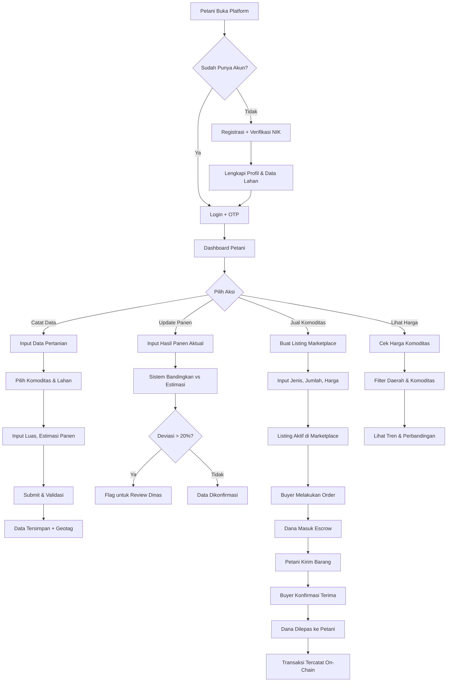

### 4.2 Flow Utama — Dinas Pertanian Daerah

Dinas daerah mengelola data regional dan membantu petani dalam penggunaan platform.

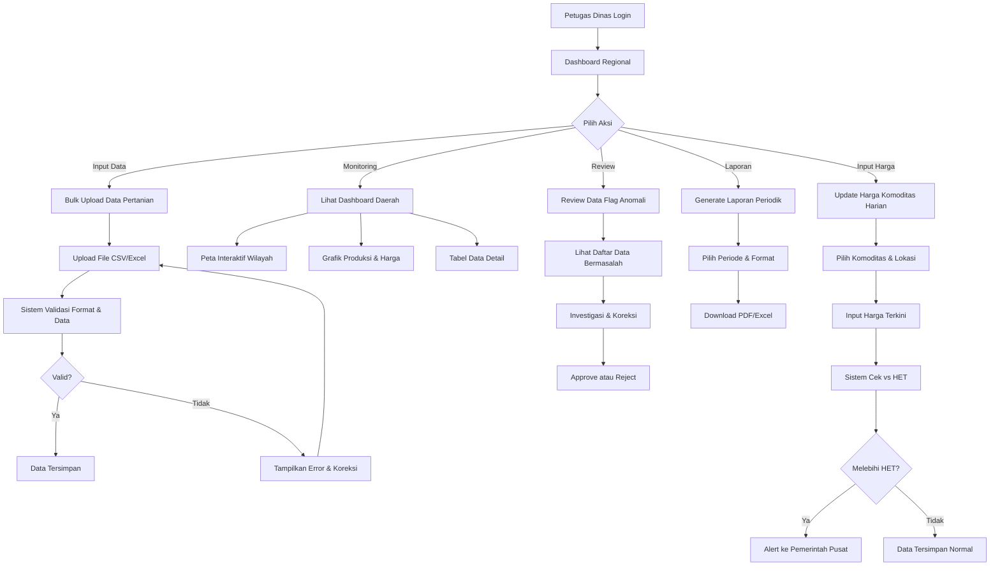

### 4.3 Flow Utama — Pemerintah Pusat

Pemerintah pusat melakukan monitoring nasional dan pengambilan keputusan.

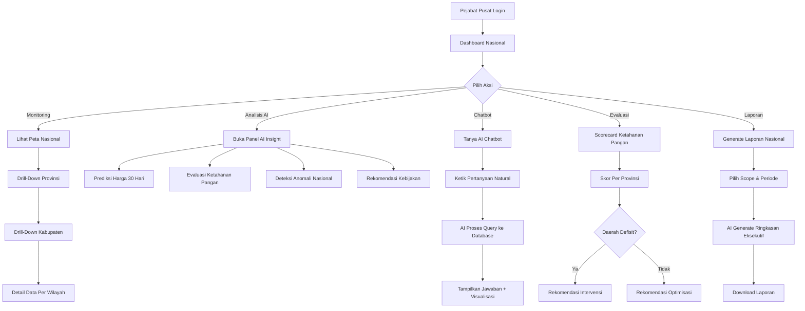

### 4.4 Flow Utama — Bulog

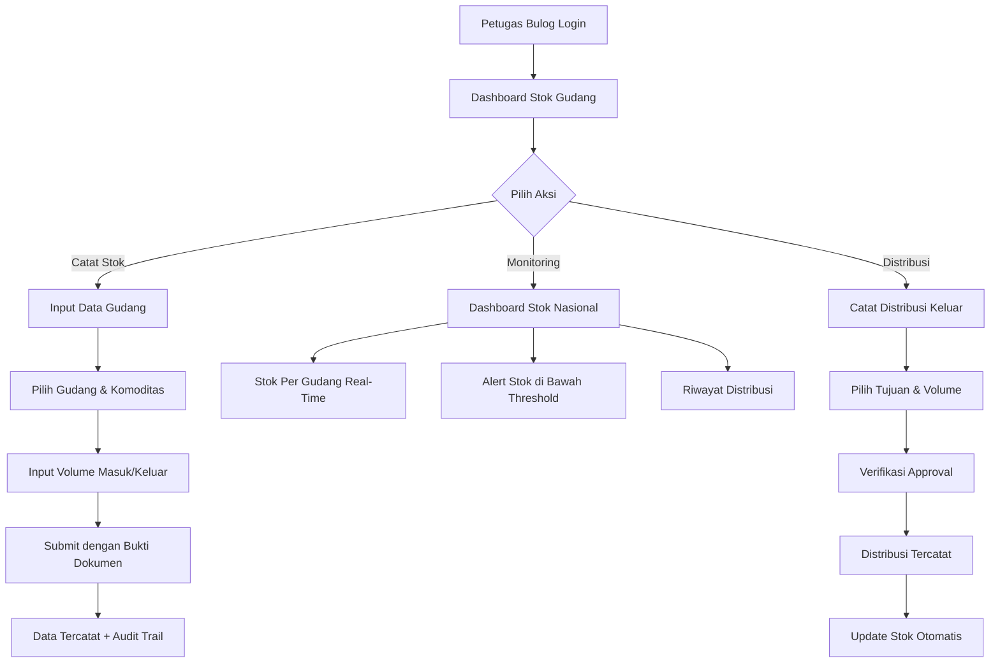

---

## 5. Architecture

### 5.1 High-Level Architecture

Sistem menggunakan arsitektur **microservice** dengan pemisahan jelas antara layer data, business logic, AI, blockchain, dan presentation.

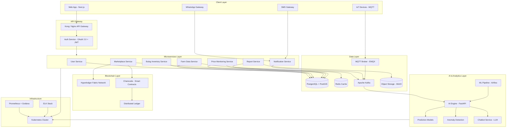

### 5.2 Blockchain Architecture Detail

Dipilih **Hyperledger Fabric** karena alasan berikut:
- **Permissioned network** — Hanya pihak terverifikasi yang bisa berpartisipasi, cocok untuk konteks pemerintah.
- **Throughput tinggi** — Mendukung >1000 TPS, jauh melebihi kebutuhan marketplace komoditas.
- **Data privacy** — Mendukung private channels untuk data sensitif antar instansi.
- **No gas fee** — Tidak ada biaya per transaksi seperti public blockchain.
- **Enterprise-grade** — Digunakan oleh banyak proyek pemerintah dan supply chain global.

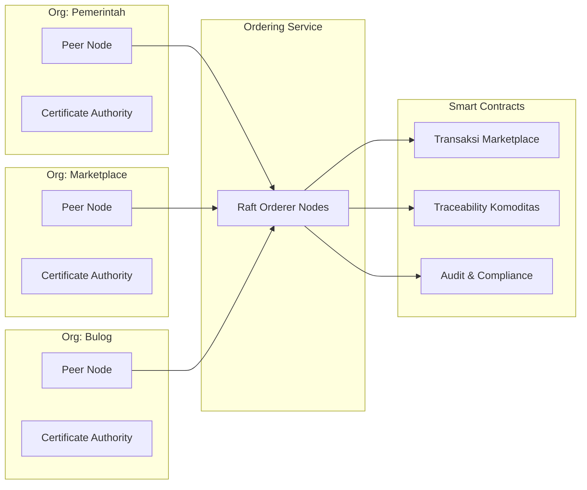

### 5.3 AI Architecture Detail

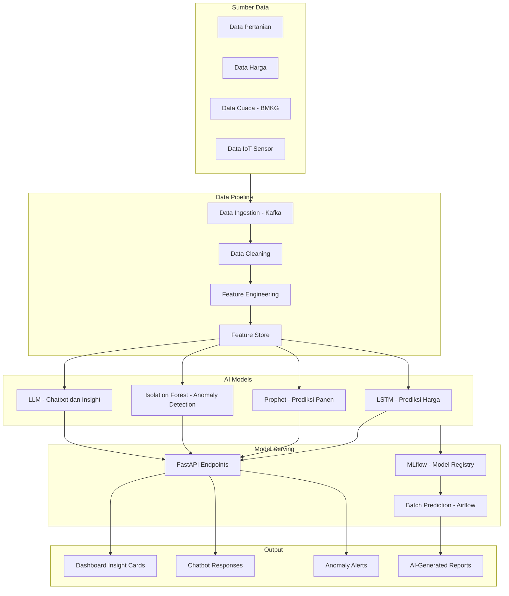

---

## 6. Sequence Diagram

### 6.1 Skenario: Petani Menjual Komoditas via Marketplace (Happy Path)

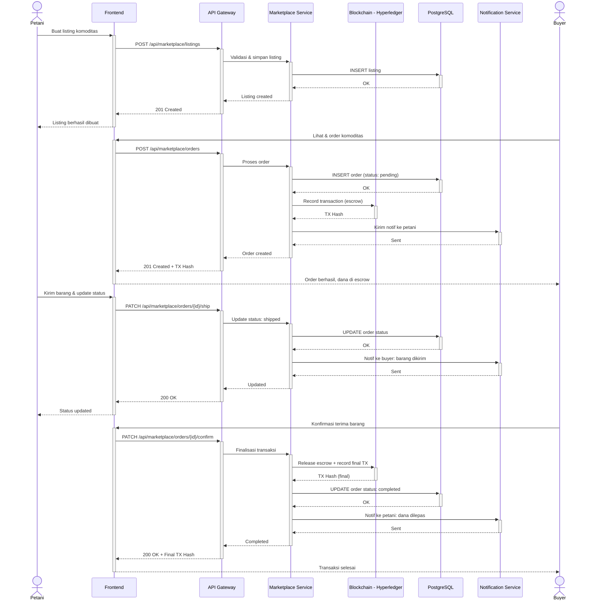

### 6.2 Skenario: Deteksi Anomali Harga (Sistem Otomatis)

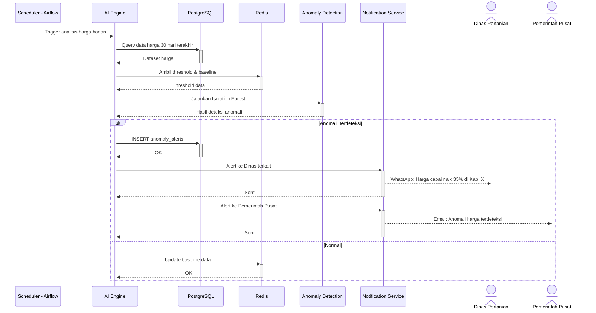

### 6.3 Skenario: AI Chatbot Query Data

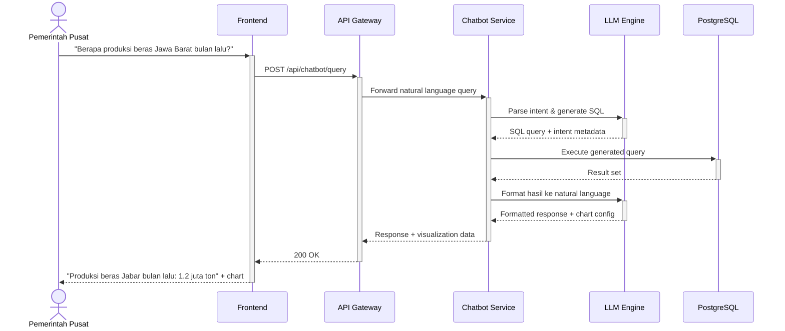

---

## 7. Database Schema

### 7.1 Entity Relationship Diagram

```mermaid
erDiagram
    USERS ||--o{ USER_ROLES : has
    USERS ||--o{ FARM_DATA : records
    USERS ||--o{ MARKETPLACE_LISTINGS : creates
    USERS ||--o{ ORDERS : "buys/sells"
    USERS ||--o{ NOTIFICATIONS : receives
    
    REGIONS ||--o{ USERS : "located_in"
    REGIONS ||--o{ FARM_DATA : "belongs_to"
    REGIONS ||--o{ PRICE_DATA : "has"
    REGIONS ||--o{ BULOG_WAREHOUSES : "located_in"
    REGIONS }|--|| REGIONS : "parent_region"

    COMMODITIES ||--o{ FARM_DATA : "type_of"
    COMMODITIES ||--o{ PRICE_DATA : "tracked_for"
    COMMODITIES ||--o{ MARKETPLACE_LISTINGS : "sells"
    COMMODITIES ||--o{ BULOG_STOCK : "stored_as"

    FARM_DATA ||--o{ HARVEST_RECORDS : has
    
    BULOG_WAREHOUSES ||--o{ BULOG_STOCK : stores
    BULOG_WAREHOUSES ||--o{ BULOG_DISTRIBUTIONS : distributes
    
    MARKETPLACE_LISTINGS ||--o{ ORDERS : generates
    ORDERS ||--|| BLOCKCHAIN_TX : "recorded_on"
    ORDERS ||--o{ ORDER_STATUS_LOG : tracks
    
    AI_PREDICTIONS ||--o{ ANOMALY_ALERTS : triggers

    USERS {
        uuid id PK
        string nik UK "NIK atau Kode Instansi"
        string name
        string email UK
        string phone
        string password_hash
        enum status "active, inactive, suspended"
        uuid region_id FK
        timestamp created_at
        timestamp updated_at
    }

    USER_ROLES {
        uuid id PK
        uuid user_id FK
        enum role "superadmin, gov_central, gov_regional, bulog, farmer, distributor, consumer"
        jsonb permissions
        timestamp assigned_at
    }

    REGIONS {
        uuid id PK
        string name
        enum level "province, regency, district, village"
        uuid parent_id FK "Self-referencing"
        geometry boundary "PostGIS polygon"
        point centroid "PostGIS point"
        string code "Kode Wilayah BPS"
    }

    COMMODITIES {
        uuid id PK
        string name "Padi, Jagung, Cabai, dll"
        enum category "grain, vegetable, fruit, spice, other"
        string unit "ton, kg, kwintal"
        decimal het "Harga Eceran Tertinggi"
    }

    FARM_DATA {
        uuid id PK
        uuid user_id FK "Petani atau Petugas Dinas"
        uuid region_id FK
        uuid commodity_id FK
        decimal land_area "Hektar"
        decimal estimated_harvest "Ton"
        date planting_date
        date estimated_harvest_date
        enum status "planted, growing, harvested, reported"
        point location "PostGIS geotag"
        timestamp created_at
    }

    HARVEST_RECORDS {
        uuid id PK
        uuid farm_data_id FK
        decimal actual_harvest "Ton"
        decimal deviation_pct "Deviasi vs estimasi"
        boolean flagged "True jika deviasi > 20%"
        text notes
        date harvest_date
        uuid verified_by FK "Petugas Dinas yang verifikasi"
    }

    PRICE_DATA {
        uuid id PK
        uuid commodity_id FK
        uuid region_id FK
        decimal price "Harga per unit"
        date recorded_date
        uuid recorded_by FK
        enum source "manual, api_bps, scraping"
        boolean exceeds_het
    }

    BULOG_WAREHOUSES {
        uuid id PK
        string name
        uuid region_id FK
        decimal capacity "Kapasitas maksimal (ton)"
        point location
    }

    BULOG_STOCK {
        uuid id PK
        uuid warehouse_id FK
        uuid commodity_id FK
        decimal current_stock "Ton"
        decimal min_threshold "Batas minimum alert"
        timestamp last_updated
    }

    BULOG_DISTRIBUTIONS {
        uuid id PK
        uuid warehouse_id FK
        uuid commodity_id FK
        decimal volume "Ton"
        enum direction "in, out"
        uuid destination_region_id FK
        string recipient "Institusi penerima"
        text document_ref "Nomor dokumen"
        uuid recorded_by FK
        timestamp distribution_date
    }

    MARKETPLACE_LISTINGS {
        uuid id PK
        uuid seller_id FK
        uuid commodity_id FK
        decimal quantity "Ton/Kg"
        decimal price_per_unit
        uuid region_id FK
        enum status "active, sold, expired, cancelled"
        text description
        timestamp created_at
        timestamp expires_at
    }

    ORDERS {
        uuid id PK
        uuid listing_id FK
        uuid buyer_id FK
        uuid seller_id FK
        decimal quantity
        decimal total_price
        enum status "pending, paid, shipped, delivered, completed, disputed, cancelled"
        string blockchain_tx_hash
        timestamp created_at
        timestamp updated_at
    }

    ORDER_STATUS_LOG {
        uuid id PK
        uuid order_id FK
        enum old_status
        enum new_status
        uuid changed_by FK
        text notes
        timestamp changed_at
    }

    BLOCKCHAIN_TX {
        uuid id PK
        uuid order_id FK
        string tx_hash UK
        string block_number
        jsonb tx_data
        enum tx_type "escrow_lock, escrow_release, transfer, refund"
        timestamp recorded_at
    }

    AI_PREDICTIONS {
        uuid id PK
        uuid commodity_id FK
        uuid region_id FK
        enum prediction_type "price, harvest, surplus_deficit"
        jsonb prediction_data "Hasil prediksi detail"
        decimal confidence_score
        date prediction_date "Tanggal prediksi dibuat"
        date target_date "Tanggal yang diprediksi"
        decimal actual_value "Nilai aktual (diisi setelah terjadi)"
    }

    ANOMALY_ALERTS {
        uuid id PK
        uuid prediction_id FK
        enum anomaly_type "price_spike, hoarding, data_mismatch"
        uuid region_id FK
        uuid commodity_id FK
        text description
        enum severity "low, medium, high, critical"
        enum status "open, investigating, resolved, false_positive"
        uuid assigned_to FK
        timestamp detected_at
        timestamp resolved_at
    }

    NOTIFICATIONS {
        uuid id PK
        uuid user_id FK
        enum channel "email, push, whatsapp, sms"
        string title
        text message
        enum status "pending, sent, failed"
        jsonb metadata
        timestamp sent_at
    }

    IOT_SENSOR_DATA {
        uuid id PK
        string device_id
        uuid region_id FK
        uuid farm_data_id FK
        enum sensor_type "soil_moisture, temperature, humidity, rainfall, ph"
        decimal value
        timestamp recorded_at
    }

    AUDIT_LOG {
        uuid id PK
        uuid user_id FK
        string action "CREATE, UPDATE, DELETE"
        string entity_type "farm_data, price_data, order, dll"
        uuid entity_id
        jsonb old_value
        jsonb new_value
        string ip_address
        timestamp created_at
    }
```

### 7.2 Catatan Schema

- **REGIONS** menggunakan self-referencing (`parent_id`) untuk hierarki: Provinsi → Kabupaten → Kecamatan → Desa.
- **PostGIS** digunakan untuk menyimpan data geospasial (boundary polygon, centroid point, geotag lokasi lahan).
- **AUDIT_LOG** mencatat semua perubahan data untuk kebutuhan compliance dan investigasi.
- **BLOCKCHAIN_TX** menyimpan referensi ke transaksi on-chain; data detail ada di ledger Hyperledger.
- **AI_PREDICTIONS** menyimpan histori prediksi beserta confidence score, dan field `actual_value` diisi setelah tanggal target tercapai untuk evaluasi akurasi model.

---

## 8. Tech Stack

### 8.1 Frontend

| Teknologi | Alasan |
|-----------|--------|
| **Next.js 14 (App Router)** | SSR untuk SEO & performa, React ecosystem yang matang, API routes untuk BFF pattern |
| **Tailwind CSS** | Utility-first CSS yang cepat untuk development, konsisten, dan mudah di-maintain |
| **Mapbox GL JS** | Peta interaktif high-performance dengan dukungan choropleth, custom layer, dan geospatial data |
| **Recharts + D3.js** | Recharts untuk chart standar (bar, line, pie), D3 untuk visualisasi custom yang kompleks |
| **TanStack Table** | Tabel data powerful dengan sorting, filtering, pagination, dan ekspor bawaan |
| **next-intl** | Internationalization untuk dual language (ID + EN) |

### 8.2 Backend

| Teknologi | Alasan |
|-----------|--------|
| **NestJS (TypeScript)** | Framework backend terstruktur (modular, DI, guards), cocok untuk microservice architecture |
| **Kong API Gateway** | API gateway enterprise-grade untuk routing, rate limiting, auth, dan monitoring |
| **Apache Kafka** | Message streaming untuk event-driven architecture, handle data IoT, dan async processing |
| **Bull (Redis Queue)** | Job queue untuk notifikasi, report generation, dan background task |

### 8.3 AI & Machine Learning

| Teknologi | Alasan |
|-----------|--------|
| **Python FastAPI** | AI microservice dengan performa tinggi, async support, dan auto-generated docs |
| **Prophet + LSTM (PyTorch)** | Prophet untuk prediksi harga (seasonal), LSTM untuk pattern kompleks multi-variabel |
| **Scikit-learn (Isolation Forest)** | Anomaly detection yang proven untuk deteksi penimbunan dan lonjakan harga |
| **LangChain + OpenAI/Anthropic API** | Framework chatbot yang fleksibel dengan kemampuan query database via natural language |
| **MLflow** | Model versioning, experiment tracking, dan model serving |
| **Apache Airflow** | Orchestration pipeline ML untuk batch prediction dan retraining terjadwal |

### 8.4 Blockchain

| Teknologi | Alasan |
|-----------|--------|
| **Hyperledger Fabric 2.5** | Permissioned blockchain, throughput tinggi, no gas fee, cocok untuk konsortium pemerintah |
| **Chaincode (Go)** | Smart contract bahasa Go untuk performa optimal di Hyperledger |
| **Hyperledger Explorer** | Dashboard monitoring blockchain network |

### 8.5 Database & Storage

| Teknologi | Alasan |
|-----------|--------|
| **PostgreSQL 16 + PostGIS** | RDBMS mature dengan extension geospatial untuk peta dan data lokasi |
| **Redis** | Cache layer untuk data harga real-time, session, dan rate limiting |
| **MinIO** | Object storage S3-compatible untuk dokumen, foto, dan laporan (self-hosted) |
| **EMQX** | MQTT broker enterprise untuk ingest data IoT sensor |

### 8.6 Infrastructure & DevOps

| Teknologi | Alasan |
|-----------|--------|
| **Docker + Kubernetes** | Containerisasi dan orchestration untuk microservice scalability |
| **Terraform** | Infrastructure as Code untuk provisioning cloud resource |
| **GitHub Actions** | CI/CD pipeline terintegrasi dengan repository |
| **Prometheus + Grafana** | Monitoring metrics, alerting, dan dashboard infra |
| **ELK Stack** | Centralized logging (Elasticsearch + Logstash + Kibana) |
| **Cloud: GCP (primary)** | Google Cloud karena BigQuery untuk analytics besar, GKE untuk Kubernetes, dan Maps Platform untuk integrasi peta. Alternatif: AWS jika instansi sudah ada kontrak |

### 8.7 Third-Party Services

| Service | Fungsi |
|---------|--------|
| **Twilio / Fonnte** | WhatsApp & SMS gateway untuk notifikasi |
| **Firebase Cloud Messaging** | Push notification browser |
| **SendGrid** | Email transaksional |
| **BMKG API** | Data cuaca untuk prediksi panen |
| **BPS API** | Data statistik pertanian resmi |

---

## Lampiran: Roadmap Pengembangan

### Phase 1 — MVP (Bulan 1-4)
- Manajemen user multi-role (registrasi, login, RBAC)
- Pencatatan data pertanian (input manual + bulk upload)
- Dashboard visualisasi dasar (peta, grafik, tabel)
- Monitoring harga komoditas
- Pencatatan stok Bulog

### Phase 2 — Pilot (Bulan 5-8)
- Marketplace basic (listing, order, tanpa blockchain dulu)
- AI analytics: prediksi harga & panen
- Sistem notifikasi (email + push)
- Integrasi API BPS & BMKG
- Deteksi anomali basic

### Phase 3 — Scale (Bulan 9-14)
- Integrasi Hyperledger Fabric untuk marketplace on-chain
- AI Chatbot
- WhatsApp & SMS notification
- Integrasi IoT sensor
- Evaluasi ketahanan pangan & scorecard
- Laporan AI-generated

### Phase 4 — National (Bulan 15-18)
- Integrasi Satu Data Indonesia
- Multi-region deployment
- Advanced anomaly detection
- Mobile-responsive optimization
- Performance optimization untuk skala nasional

---

*Dokumen ini adalah living document yang akan terus diperbarui seiring perkembangan project.*
